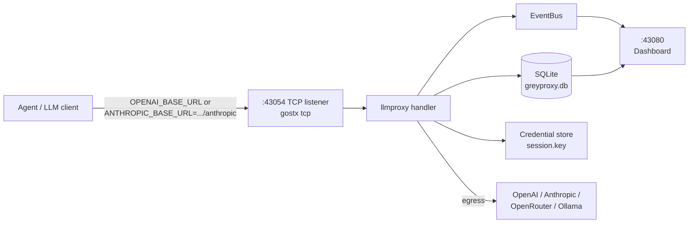
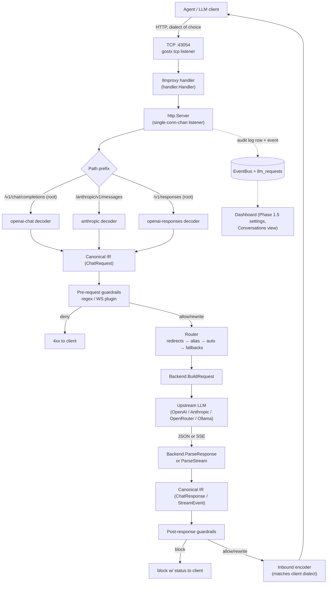
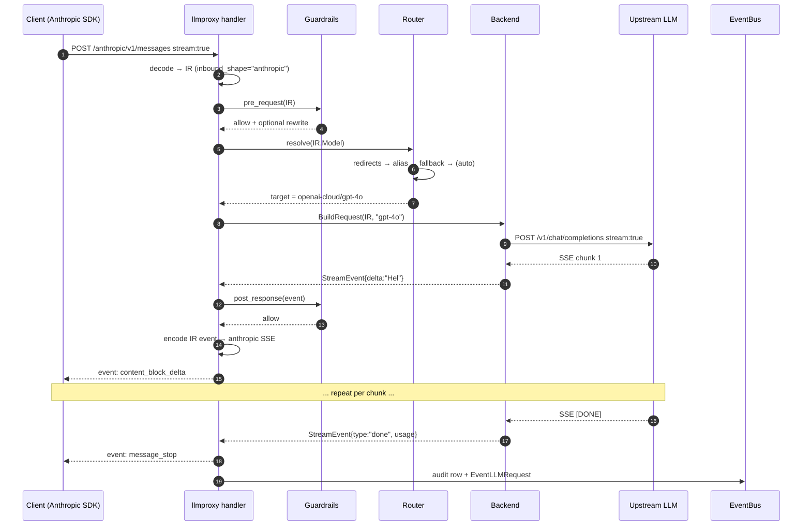
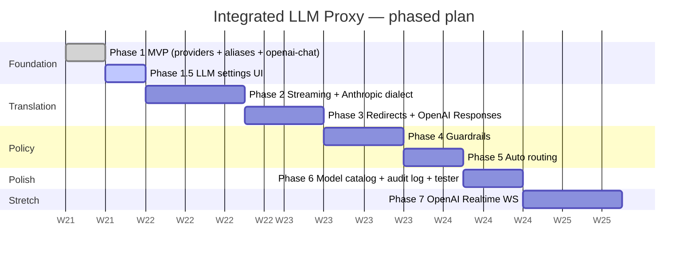

# Integrated LLM Proxy — Plan

A LiteLLM-style LLM gateway, integrated into greyproxy as a **gostx handler module** alongside the existing `http` and `socks5` handlers. Goal: small, opinionated, single-binary; reuse greyproxy's DB, dissectors, middleware system, and dashboard.

**Status (2026-05-21):** Phase 1 is implemented, tested, and committed. The
LLM settings UI (providers/models/aliases) has been pulled forward from
Phase 6 into **Phase 1.5**, which is the current focus.

---

# 0 — Confirmed decisions

These are settled as of the last review:

- **Implementation**: Go, embedded in the greyproxy binary. No Python sidecar. No second binary.
- **Integration shape**: a new **gostx handler type** (`llmproxy`) registered alongside `http` and `socks5` in `internal/gostx/handler/`. Configured in `greyproxy.yml` under the same `services:` block as the existing proxies, picked up by `loader.Load(cfg)` like every other service.
- **No MITM-based redirects.** The LLM proxy is a dedicated side service; it does not touch the existing HTTP MITM pipeline. Agents must point their `OPENAI_BASE_URL` / `ANTHROPIC_BASE_URL` at the LLM proxy port explicitly.
- **MVP scope (Phase 1)**: providers + aliases over the **OpenAI dialect at the root** (`/v1/...`). Streaming, Anthropic dialect under `/anthropic/...`, redirects, guardrails, auto routing all come later.
- **Path layout**: OpenAI is the default dialect, mounted at the root (`/v1/chat/completions`, `/v1/responses`, `/v1/models`, …). Every other dialect is mounted under a `/<provider>/` prefix (`/anthropic/v1/messages`, `/google/v1beta/...`). Matches LiteLLM's "pass-through routes" convention.
- **Dialects are static.** Every dialect compiled into the binary is always mounted. No YAML toggle, no runtime selection. Adding a new dialect (e.g. cohere) means writing a new inbound decoder/encoder pair, registering it in `mux.go`, and rebuilding.
- **UI pulled forward.** A dashboard for configuring providers/models/aliases is now **Phase 1.5** (was part of Phase 6). It reuses the already-shipped, already-tested `/api/llm/*` REST endpoints — the page is a server-rendered shell plus client-side `fetch`, so no new Go handlers are required.

---

# 1 — What we keep from LiteLLM and what we drop

LiteLLM is the most complete reference but heavy. Useful patterns to copy, anti-patterns to skip:

**Copy:**
- `model_list` shape — public **alias** (`model_name`) vs backend id (`litellm_params.model: provider/model`). Single best idea in the design.
- **Pass-through routes**: LiteLLM exposes Anthropic on `/anthropic/v1/messages`, Gemini on `/gemini/...`, Vertex on `/vertex_ai/...`. Same convention here.
- `register_model` + JSON model registry — vendor a slimmed copy of `model_prices_and_context_window.json` for context-window/cost/capability metadata.
- The abstract `BaseConfig` surface in `litellm/llms/base_llm/chat/transformation.py` — small: `TransformRequest`, `TransformResponse`, `ValidateEnv`, `GetURL`, `Sign`. Five methods. We mirror this in Go (the `Backend` interface).
- The `PreRoutingHook` interface from `litellm/router_strategy/auto_router/` — one place to make per-prompt routing decisions. Enables the "auto" model.
- Guardrail `mode: pre_call | during_call | post_call` lifecycle.
- OpenAI Chat Completions as the **canonical IR** (everything translates to/from it).

**Drop:**
- `credential_list` + `litellm_credential_name` indirection (we have a credential store already).
- Redis-coordinated routing strategies (least-busy across replicas, distributed cooldowns).
- Trained complexity-encoder model. Ship a length+keyword heuristic; remain pluggable.
- The four-section settings split (`router_settings` / `litellm_settings` / `general_settings` / `model_list`). One section.
- Per-provider directory sprawl. One file per provider, ~200 LOC each.

---

# 2 — Integration as a gostx handler

The LLM proxy gostx handler lives at `internal/gostx/handler/llmproxy/`, following the same registration pattern as `internal/gostx/handler/http/handler.go:56-58`:

```go
// internal/gostx/handler/llmproxy/handler.go
func init() {
    registry.HandlerRegistry().Register("llmproxy", NewHandler)
}
```

YAML service definition mirrors `http-proxy` and `socks5-proxy` in `greyproxy.yml`:

```yaml
services:
  - name: llm-proxy
    addr: 127.0.0.1:43054
    handler:
      type: llmproxy
      metadata:
        # optional inbound bearer-token auth, see # 9
        auth.require: false
        auth.keys: []
    listener:
      type: tcp
```

`loader.Load(cfg)` (called from `cmd/greyproxy/program.go:97`) instantiates the handler. `program.go:233-238` iterates the service registry and calls `Serve()` for free.

## Why a handler and not just an http.Server

The dashboard runs as a standalone `http.Server` (`greyproxy.NewService` at `greyproxy.go:52`) because its lifecycle is tightly coupled to the `greyproxy_api.Shared` DI container. The LLM proxy is more naturally a service: it accepts TCP connections, applies auth, speaks an HTTP-shaped protocol, and is operator-managed via the same YAML / dashboard / service-list as the proxies. Registering as a gostx handler surfaces it on the service registry, inherits the TCP listener, and lets the operator turn it off / change its port by editing YAML.

## Bridging a gostx Handler to an http.Server

`handler.Handler.Handle(ctx, conn)` is connection-oriented (one TCP conn per call). An LLM gateway is request-oriented (many requests per conn over HTTP/1.1 or HTTP/2). The bridge is a single-conn-channel listener: `Init()` creates a chan-backed `net.Listener` and starts `http.Server.Serve` in a goroutine; each `Handle(ctx, conn)` pushes the conn onto the channel; the http.Server picks it up and runs the HTTP request loop. ~30 LOC in `internal/gostx/handler/llmproxy/server.go`.

The gateway handler is resolved per-request via `llmproxy.GlobalHandler()` (an `atomic.Pointer[http.Handler]` set by `cmd/greyproxy/program.go`) — necessary because gostx services start *before* `buildGreyproxyService` finishes constructing the gateway. Requests in that window get a clean 503.

---

# 3 — Approaches compared (architectural alternatives)

Three deployment shapes were considered. **A is confirmed**; the others are documented as rejected so the choice trail is visible.

## Approach A — Embedded Go as a gostx handler *(confirmed)*

`internal/gostx/handler/llmproxy/` handler registered alongside `http` and `socks5`. Single binary, shared DB+dashboard+bus.



## Approach B — Go sidecar binary *(rejected)*

Second binary `cmd/greyproxy-llm/` sharing the SQLite DB by path.

- Rejected because SQLite under two writer processes complicates `db.go:19-43` (current pool assumes single-process ownership), doubles install/service-management surface (`cmd/greyproxy/service.go`, `install.go`), loses in-process access to `EventBus`, and breaks the "single binary" promise in `README.md:7`.

## Approach C — Python sidecar using LiteLLM as a library *(rejected)*

- Rejected because it introduces a Python runtime / venv / pip dependency to a project that has zero today, and because the user explicitly wanted LiteLLM as a *reference*, not a runtime dependency.

## Approach D — MITM-only redirect *(rejected)*

- Rejected explicitly: the LLM proxy is a dedicated side service with its own listener. The MITM pipeline is untouched. Transparent rewriting of `api.openai.com` traffic is out of scope.

---

# 4 — Architecture (Approach A in detail)



Key invariants:
- The same call always passes through the canonical IR in the middle, regardless of inbound or outbound dialect. That's how a tool speaking Anthropic can be redirected onto an OpenAI-compatible local model.
- **The path prefix the client used determines the response dialect.** If the client posts to `/v1/chat/completions`, we respond with OpenAI Chat SSE; if they post to `/anthropic/v1/messages`, we respond with Anthropic SSE.

## Streaming request, sequence view



---

# 5 — Canonical IR (OpenAI Chat Completions shape)

Lives in `internal/greyproxy/llmproxy/ir.go`. Modelled on OpenAI Chat Completions because that schema is the lowest-common-denominator interchange format LiteLLM picked, for the same reason.

```go
package llmproxy

type ChatRequest struct {
    Model           string              // public alias the client sent
    Messages        []Message
    Tools           []Tool
    ToolChoice      *ToolChoice
    Temperature     *float64
    MaxTokens       *int
    Stream          bool
    ResponseFormat  *ResponseFormat
    Reasoning       *Reasoning          // unified thinking/effort
    Metadata        map[string]string

    // Provenance (set by decoder, used by encoder + router):
    InboundShape    string              // "openai-chat" | "anthropic" | "openai-responses"
    InboundRawPath  string
    RawHeaders      http.Header
}
// Message, ContentBlock, Tool, ToolCall, ToolResult, ResponseFormat,
// Reasoning, ChatResponse, Choice, Usage, StreamEvent, Delta, ErrorInfo
// — see ir.go for the full set.
```

We already have very close types in `internal/greyproxy/dissector/dissector.go:42-105` (Message, ContentBlock, Tool, ToolCall). The IR is a tighter, encode-capable variant; we don't reuse the dissector types directly because they're extract-only and the IR needs to be marshalled back out in multiple dialects.

---

# 6 — Backend interface

Single small interface — five methods, mirrors LiteLLM's `BaseConfig`. Named `Backend` (not `Provider`) to disambiguate from the CRUD `Provider` record (the database row).

```go
type Backend interface {
    Name() string
    Validate() error
    BuildRequest(ctx context.Context, ir *ChatRequest, modelID string) (*http.Request, error)
    ParseResponse(body []byte) (*ChatResponse, error)
    ParseStream(r io.Reader, out chan<- *StreamEvent) error
}
```

Built-in backends (registered via `RegisterBackend` in `init()`):

| Backend key | Status | Notes |
|---|---|---|
| `openai` | done (P1) | near-passthrough; baseline |
| `openai-compat` | done (P1) | Ollama, LM Studio, vLLM, LiteLLM upstream — any OpenAI-compatible endpoint |
| `openrouter` | done (P1) | `openai-compat` + default base URL |
| `anthropic` | Phase 2 | the real translator; reuses dissector parsing |
| `google-ai` | Phase 3+ | |

`openai-compat` covers most "custom local model" cases — user just configures `base_url`. No new code per integration.

---

# 7 — Inbound dialects and shapes

Two concepts:

- **Dialect** — an API family the gateway accepts. OpenAI is mounted at the root; every other dialect is mounted under a `/<dialect>/` path prefix. The set of dialects is compiled into the binary — all built-in dialects are always mounted, no runtime toggle.
- **Shape** *(internal IR discriminator)* — a specific wire format. The OpenAI dialect has multiple sub-routes with distinct wire shapes (chat completions vs. responses vs. realtime), so the IR's `InboundShape` field is more granular than the dialect name.

The mapping:

| Dialect | Path prefix | Shapes mounted | Phase |
|---|---|---|---|
| `openai` | (root) | `openai-chat`, `openai-responses` (P3), `openai-realtime` (P7) | 1 |
| `anthropic` | `/anthropic/` | `anthropic` | 2 |
| `google` | `/google/` | `google-ai` | 3+ |

Each shape has a decoder (wire → IR) and an encoder (IR → wire), both in one Go file (`inbound_<shape>.go`). `/v1/models` and `/healthz` are at the root regardless of shape.

Streaming encoders translate between SSE event taxonomies (see `docs/llm-api-comparison.md`):
- Anthropic: `content_block_start` / `_delta` / `_stop`, `message_delta`
- OpenAI Chat: `delta` chunks
- OpenAI Responses: `response.output_item.added` / `.output_text.delta` / `.completed`

---

# 8 — API surface

The LLM proxy exposes **two distinct HTTP APIs** on **two distinct ports**, plus the Phase 1.5 dashboard pages:

- **Gateway API** on `:43054` — served by the gostx llmproxy handler. What LLM clients/agents hit.
- **Management API** on `:43080/api/llm/*` — served by the existing dashboard (`internal/greyproxy/api/router.go`). CRUD for providers/aliases/redirects/guardrails + audit log.
- **Dashboard UI** on `:43080` — Phase 1.5 settings pages, built on top of the Management API (see # 8.4).

Conventions:
- Management API follows existing greyproxy REST conventions (Gin, `/api/...`, `PUT` for updates, `DELETE` by id). See `RulesUpdateHandler` at `internal/greyproxy/api/router.go:87`.
- Path id segments are integer database IDs unless noted.
- Gateway error envelopes match the inbound dialect (OpenAI vs Anthropic). Management API errors use a uniform `{error: string}` JSON shape.

## 8.1 — Gateway API (:43054)

### Default — OpenAI dialect (always at root, Phase 1+)

| Method | Path | Phase | Description |
|---|---|---|---|
| POST | `/v1/chat/completions` | 1 ✅ | OpenAI Chat Completions. Non-streaming in P1; SSE in P2. |
| GET | `/v1/models` | 1 ✅ | Enumerate enabled aliases as OpenAI Model objects. |
| GET | `/v1/models/:name` | 1 ✅ | Single alias. 404 if unknown or disabled. |
| POST | `/v1/responses` | 3 | OpenAI Responses API. SSE only. |
| GET (Upgrade) | `/v1/realtime` | 7 | OpenAI Realtime API over WebSocket (pass-through). |

### `anthropic` dialect (`/anthropic/`, Phase 2+)

| Method | Path | Phase | Description |
|---|---|---|---|
| POST | `/anthropic/v1/messages` | 2 | Anthropic Messages API. |
| POST | `/anthropic/v1/messages/count_tokens` | 2 stretch | Token counter. |

### `google` dialect (`/google/`, Phase 3+)

| Method | Path | Phase | Description |
|---|---|---|---|
| POST | `/google/v1beta/models/:model::action` | 3+ | Gemini generateContent / streamGenerateContent. |

### Cross-cutting

| Method | Path | Phase | Description |
|---|---|---|---|
| GET | `/healthz` | 1 ✅ | Liveness probe. No auth. `{"status":"ok"}`. |
| OPTIONS | (any) | 1 ✅ | CORS preflight. |

### Gateway error envelopes

- OpenAI dialect (`/v1/...`): `{"error":{"message":"...","type":"invalid_request_error","code":"alias_unknown"}}`
- Anthropic dialect (`/anthropic/v1/...`): `{"type":"error","error":{"type":"invalid_request_error","message":"..."}}`

Status codes: 400 client error, 403 guardrail deny, 404 unknown alias, 422 disabled alias/provider, 502 upstream failure with no fallback.

## 8.2 — Management API (:43080/api/llm/*)

### Providers — Phase 1 ✅

| Method | Path | Description |
|---|---|---|
| GET | `/api/llm/providers` | List. `api_key` never returned in plaintext; payload has `key_set` + `key_preview`. |
| POST | `/api/llm/providers` | Create. `{name, type, base_url, api_key?, metadata?, enabled?}`. |
| GET | `/api/llm/providers/:id` | Detail. |
| PUT | `/api/llm/providers/:id` | Update. Omit `api_key` to leave it unchanged. |
| DELETE | `/api/llm/providers/:id` | Delete. 409 if any alias references it. |
| POST | `/api/llm/providers/:id/test` | Phase 6: smoke-test the upstream. |
| POST | `/api/llm/providers/:id/rotate-key` | Phase 6: replace the encrypted key in place. |

### Aliases (a.k.a. "models") — Phase 1 ✅

| Method | Path | Description |
|---|---|---|
| GET | `/api/llm/aliases` | List. |
| POST | `/api/llm/aliases` | Create. `{name, provider_id, model_id, fallbacks?, is_auto?, auto?, enabled?}`. |
| GET | `/api/llm/aliases/:id` | Detail. |
| PUT | `/api/llm/aliases/:id` | Update. |
| DELETE | `/api/llm/aliases/:id` | Delete. |

### Introspection — Phase 1 ✅

| Method | Path | Description |
|---|---|---|
| GET | `/api/llm/provider-types` | Backend implementations compiled in (`openai`, `openai-compat`, `openrouter`). |

### Later phases

- Redirects `/api/llm/redirects` (Phase 3), Guardrails `/api/llm/guardrails` (Phase 4), Audit log `/api/llm/requests` (Phase 1 minimal → Phase 6 detail), Catalog `/api/llm/catalog` + `/test` + `/export` (Phase 6).

### WebSocket events on the existing `/ws`

`router.go:147` already exposes `GET /ws`. New event types in `events.go`: `llm_request_new`, `llm_provider_changed`, `llm_alias_changed` (P1.5+), `llm_redirect_changed` (P3), `llm_guardrail_changed` / `llm_guardrail_hit` (P4).

## 8.4 — Dashboard UI (Phase 1.5)

A new top-level **LLM** page on the dashboard (`:43080/llm`), styled like the existing `rules` / `settings` pages. It is a server-rendered shell plus client-side `fetch` against the existing `/api/llm/*` endpoints — no new Go handlers, no extension of `RegisterHTMXRoutes`'s signature.

Sections on the page:

1. **Providers** — table (name, type, base_url, key set?, enabled) + add/edit modal. Type is a dropdown populated from `GET /api/llm/provider-types`. `api_key` is a write-only password field; the table shows `key_preview` and a "rotate" affordance. Delete shows the 409-in-use error inline when an alias references the provider.
2. **Aliases / Models** — table (name → provider/model, fallbacks, enabled) + add/edit modal. Provider is a dropdown populated from `GET /api/llm/providers`; model_id is free text (Phase 6 will add catalog autocomplete).
3. **Gateway info** — read-only banner: the gateway base URL (`http://127.0.0.1:43054`), the OpenAI/Anthropic env-var hints, and a copy-to-clipboard for a sample curl.

Live refresh: after any mutation the page refetches the affected list; optionally subscribes to `llm_provider_changed` / `llm_alias_changed` on the existing `/ws` for multi-tab consistency.

---

# 9 — Config shape

The listener/service is a regular gostx service (`services:` block). Everything else — providers, aliases, redirects, guardrails — lives under a top-level `llm:` section that is **database-seeded on first start only**; after that the database is authoritative and the dashboard / API drive changes.

```yaml
services:
  - name: llm-proxy
    addr: 127.0.0.1:43054
    handler:
      type: llmproxy
      metadata:
        auth.require: false
        auth.keys: []
    listener:
      type: tcp

llm:
  providers:
    - name: openai-cloud
      type: openai
      base_url: https://api.openai.com
      api_key: env:OPENAI_API_KEY
    - name: openrouter
      type: openrouter
      base_url: https://openrouter.ai/api/v1
      api_key: env:OPENROUTER_API_KEY
    - name: ollama
      type: openai-compat
      base_url: http://localhost:11434/v1
  models:
    - name: fast
      target: openai-cloud/gpt-4o-mini
    - name: smart
      target: openai-cloud/gpt-4o
    - name: local
      target: ollama/llama3.2
```

Loaded via `viper.UnmarshalKey("llm", &seed)` in `cmd/greyproxy/program.go`. **Every `SeedConfig` field carries a `mapstructure` tag** — viper decodes via mapstructure, not the yaml library, so snake_case keys like `base_url` need explicit tags or they silently fail to bind. `api_key` accepts a literal or `env:NAME`.

---

# 10 — Storage (SQLite — migration 15)

Phase 1 ships the `llm_providers` and `llm_aliases` tables (migration 15 in the real numbering). `llm_redirects` / `llm_guardrails` / `llm_requests` land in their respective phases.

```sql
CREATE TABLE llm_providers (
  id INTEGER PRIMARY KEY AUTOINCREMENT,
  name TEXT NOT NULL UNIQUE,
  type TEXT NOT NULL,
  base_url TEXT NOT NULL,
  api_key_enc BLOB,          -- AES-256-GCM via session.key
  key_preview TEXT,
  enabled INTEGER NOT NULL DEFAULT 1,
  metadata_json TEXT,
  user_defined INTEGER NOT NULL DEFAULT 1,
  created_at DATETIME NOT NULL DEFAULT (datetime('now')),
  updated_at DATETIME NOT NULL DEFAULT (datetime('now'))
);

CREATE TABLE llm_aliases (
  id INTEGER PRIMARY KEY AUTOINCREMENT,
  name TEXT NOT NULL UNIQUE,
  provider_id INTEGER REFERENCES llm_providers(id) ON DELETE RESTRICT,
  model_id TEXT NOT NULL DEFAULT '',
  fallbacks_json TEXT,
  enabled INTEGER NOT NULL DEFAULT 1,
  is_auto INTEGER NOT NULL DEFAULT 0,
  auto_json TEXT,
  created_at DATETIME NOT NULL DEFAULT (datetime('now')),
  updated_at DATETIME NOT NULL DEFAULT (datetime('now'))
);
```

API keys reuse the existing AES-GCM key in `~/.local/share/greyproxy/session.key` (`LoadOrGenerateKey`). SQLite foreign keys are **not** enforced under the modernc driver, so `CreateAlias` validates the provider exists at the application level.

---

# 11 — Code layout (as built + planned)

```
internal/
├── gostx/handler/llmproxy/            gostx handler  [P1 ✅]
│   ├── handler.go                     handler.Handler impl + init() registration
│   ├── metadata.go                    parse auth.* from YAML metadata
│   ├── server.go                      single-conn-chan listener bridge
│   ├── handler_test.go                bridge + auth + 503 tests
│   └── e2e_test.go                    full-stack round-trip test
│
└── greyproxy/llmproxy/                proxy logic  [P1 ✅]
    ├── ir.go                          canonical IR types
    ├── config.go                      SeedConfig (+ mapstructure tags) + config_test.go
    ├── crud.go                        Store: providers + aliases CRUD, ResolveAlias
    ├── seed.go                        YAML → DB seed-on-first-start
    ├── router.go                      Router (alias resolution; redirects/auto later)
    ├── mux.go                         Server: path dispatch + hot path
    ├── shared.go                      GlobalHandler atomic pointer
    ├── inbound_openai_chat.go         openai-chat decode + encode
    ├── provider_iface.go              Backend interface + factory registry
    ├── provider_openai.go             openai / openai-compat / openrouter
    └── *_test.go                      crud, provider, inbound, mux, seed, e2e

    # Phase 2+ (planned, same package):
    #   inbound_anthropic.go, inbound_openai_responses.go, inbound_openai_realtime.go
    #   provider_anthropic.go, provider_google.go
    #   guardrail.go, auto.go, stream.go

internal/greyproxy/
├── api/
│   ├── llm_providers.go               provider CRUD handlers   [P1 ✅]
│   ├── llm_aliases.go                 alias CRUD handlers       [P1 ✅]
│   ├── llm_misc.go                    provider-types            [P1 ✅]
│   ├── llm_test.go                    HTTP-level CRUD tests     [P1 ✅]
│   └── router.go                      /api/llm/* routes + Shared.LLMStore
├── ui/                                 [P1.5 — NEW]
│   ├── pages.go                       add GET /llm page route
│   ├── templates/base.html            add "LLM" nav entry (desktop + mobile)
│   ├── templates/llm.html             providers + aliases sections
│   └── static/js/llm.js               fetch-based CRUD against /api/llm/*
├── migrations.go                      migration 15 (providers + aliases)  [P1 ✅]
└── (config field unused — seed lives in llmproxy.SeedConfig)

cmd/greyproxy/
├── program.go                         seed + SetGlobalHandler + Shared.LLMStore  [P1 ✅]
└── register.go                        blank import of gostx/handler/llmproxy     [P1 ✅]

greyproxy.yml                          llm-proxy service + active llm: seed block  [P1 ✅]
```

Note: the originally-planned `inbound/` and `provider/` subpackages were collapsed into the parent `llmproxy` package (file-name prefixes preserve the grouping) to avoid an import cycle — both depended on the IR types defined in the parent.

---

# 12 — Reuse of existing greyproxy infrastructure

| Need | Reuse |
|---|---|
| Parse wire formats | `internal/greyproxy/dissector/` (Anthropic, OpenAI, OpenAI-Chat, OpenAI-WS, Google AI) |
| Endpoint patterns | `endpoint_registry.go:14-24` rule shape inspires `llm_redirects` |
| External guardrails | `internal/greyproxy/middleware/` (WebSocket cascade) — new hook types `llm-request`, `llm-response` |
| Hook filter `LLM` | `middleware/types.go:56-60` already gates on dissector presence |
| Encrypted secrets | `credential_crypto.go` + `session.key` |
| DB + migrations | `db.go`, `migrations.go` |
| Event bus | `events.go` |
| Dashboard scaffolding | `internal/greyproxy/ui/` templates + `static/` |
| Handler registration | `internal/gostx/registry/registry.go` |
| YAML service loading | `internal/gostx/config/loader/` |

## How the handler reaches in-process state

`cmd/greyproxy/program.go` constructs the `llmproxy.Store` (with `session.key`) and `Server`, then calls `llmproxy.SetGlobalHandler(server)`. The gostx handler reads `llmproxy.GlobalHandler()` per request. Mirrors the existing `gostx.SetGlobalMitmHook` package-singleton pattern.

---

# 13 — Phased delivery



**Phase 1 — Minimum viable proxy** ✅ *(landed)*
- gostx `llmproxy` handler + single-conn-chan bridge
- `llmproxy` package: IR, Store (providers + aliases CRUD), Backend interface, `openai`/`openai-compat`/`openrouter`, openai-chat inbound, Router, Server
- migration 15, seed-from-YAML, `SetGlobalHandler` wiring
- Management API: `/api/llm/providers`, `/api/llm/aliases`, `/api/llm/provider-types`
- Gateway: `/v1/chat/completions`, `/v1/models`, `/v1/models/:name`, `/healthz`
- Embedded `greyproxy.yml` with active `llm:` block
- Tests: package coverage ~86%, gostx handler ~88%, HTTP-level API CRUD, full-stack e2e

**Phase 1.5 — LLM settings UI** *(current focus)*
- New `/llm` dashboard page (`ui/templates/llm.html` + nav entry in `base.html`)
- Providers section: list + add/edit/delete modal, type dropdown from `/api/llm/provider-types`, write-only api_key field, in-use 409 surfaced inline
- Aliases section: list + add/edit/delete modal, provider dropdown, model_id text, fallbacks
- Gateway info banner (base URL + sample curl)
- Client-side `fetch` against existing `/api/llm/*`; no new Go handlers
- Tests: `pages_test.go` asserts the page renders and the nav entry is present; a lightweight DOM/route smoke test that `/llm` returns 200 and includes the section anchors

**Phase 2 — Streaming + Anthropic dialect**
- SSE relay through the openai-chat encoder
- `anthropic` dialect under `/anthropic/`: `inbound_anthropic.go` decode/encode + `provider_anthropic.go`
- Cross-dialect: Anthropic SDK → OpenAI cloud and vice-versa
- Tests: SSE assembly, cross-dialect golden tests using `dissector/testdata`

**Phase 3 — Redirects + OpenAI Responses inbound**
- `llm_redirects` table + match engine; `openai-responses` decode/encode
- Management API + dashboard page for redirects
- Tests: redirect match precedence, responses round-trip

**Phase 4 — Guardrails**
- `llm_guardrails` table + engine (regex deny/rewrite/redact, length, json-schema); WS middleware hook types `llm-request`/`llm-response`
- Management API + dashboard page + hit log
- Tests: each guardrail type, deny short-circuit, external WS guardrail

**Phase 5 — Auto routing**
- `PreRoutingHook` interface + built-in heuristic (token estimate + PII regex); `auto` alias wired up
- Tests: rule partitioning over a labelled prompt set

**Phase 6 — Model catalog + audit log + tester**
- Vendor slim `model_catalog.json`; `/api/llm/catalog*`, `/test`, `/export`, provider `test`/`rotate-key`, redirect `preview`
- LLM requests log page; "try it" tester panel; catalog autocomplete on the aliases form
- Tests: catalog lookup, export/import round-trip

**Phase 7 — Realtime / WebSocket (stretch)**
- `openai-realtime` inbound (pass-through first), behind a feature flag

**Per-phase rule:** every phase ships its own test set — unit tests for new decoders/encoders/backends, HTTP-level tests for new management endpoints, and an e2e test for any new cross-dialect path. The Phase 1 suite is the template.

---

# 14 — Open questions / decisions deferred

- **API key auth on the inbound side**: off by default (local dev), wired to the credential system later. Configured via handler metadata `auth.require` / `auth.keys`.
- **Bind to 127.0.0.1 vs 0.0.0.0**: default 127.0.0.1 in the embedded `greyproxy.yml` (holds upstream API keys); opt in to wider binding explicitly.
- **Cost/quota tracking**: store usage in `llm_requests` from Phase 6; no enforcement until later.
- **Model catalog auto-refresh**: vendor a static JSON for v1; add an "Update catalog" button later.
- **MCP integration**: out of scope for v1; revisit after Phase 7.
- **Anthropic→OpenAI thinking translation**: lossy by definition (OpenAI reasoning is encrypted). Document the limitation; emit a tag so the UI can show it.
- **UI: HTMX partials vs fetch**: Phase 1.5 uses client-side `fetch` against the JSON API (the API is already tested, and it avoids threading `LLMStore` through `RegisterHTMXRoutes`). If the dashboard later standardises on server-rendered HTMX partials for everything, the LLM page can be migrated then.

---

# 15 — Next step (Phase 1.5)

File-by-file order:
1. `internal/greyproxy/ui/templates/llm.html` — page with Providers + Aliases sections and modals
2. `internal/greyproxy/ui/templates/base.html` — add the "LLM" nav entry (desktop + mobile)
3. `internal/greyproxy/static/js/llm.js` — fetch-based CRUD against `/api/llm/*` (embedded via the existing `static` FS)
4. `internal/greyproxy/ui/pages.go` — `parseTemplate("base.html","base.html","llm.html")` + `GET /llm` route
5. `internal/greyproxy/ui/pages_test.go` — assert `/llm` renders 200 with the section anchors and nav entry

Milestone: open `http://localhost:43080/llm`, add a provider and an alias through the form, then `curl :43054/v1/chat/completions -d '{"model":"<new-alias>",...}'` succeeds — all without editing YAML or restarting.
